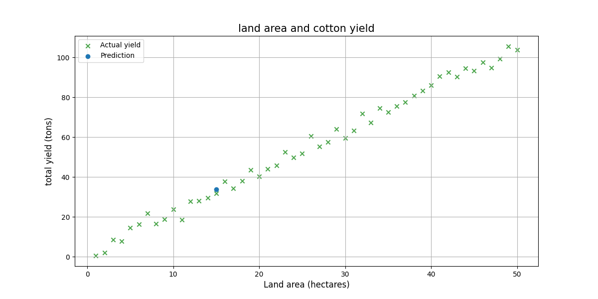

# Cotton Yield Predictor

This project is a simple yet powerful machine learning tool that predicts **cotton yield (in tons)** based on agricultural input data such as rainfall, fertilizer, seed quality, irrigation count, and land size.

---

## Features

- Train a Linear Regression model on your data
- Predict cotton yield with new inputs
- Visualize the relationship between yield and features
- Easy to use terminal menu

---

## Installation

```bash
git clone https://github.com/Bobur-Boboyev/cotton-yield-predictor.git
cd cotton-yield-predictor
pip install -r requirements.txt
```

---

## How to Use

### 1. Run the main menu:
```bash
python main.py
```

### 2. Options:
```
1 - Train model        → Retrains the model using CSV data
2 - Predict yield      → Enter inputs and get predicted cotton yield
3 - Visualize data     → See relationships in the data
0 - Exit               → Quit the app
```

---

## Model

The model used is **Linear Regression** from scikit-learn. It was trained on sample cotton farming data with the following features:

- `rainfall_mm`
- `fertilizer_kg`
- `seed_quality` (scale of 1 to 10)
- `irrigation_count`
- `land_hectare`

Target: `total_yield_ton`

---

## Example Visualization

> Area and yield:



---

## Requirements

- Python 3.8+
- pandas
- scikit-learn
- matplotlib

```bash
pip install -r requirements.txt
```
